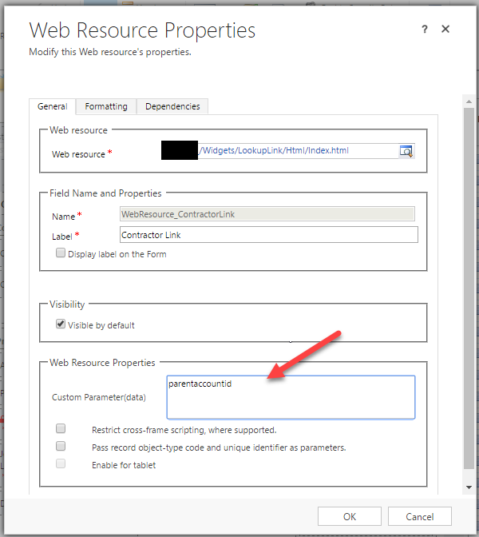
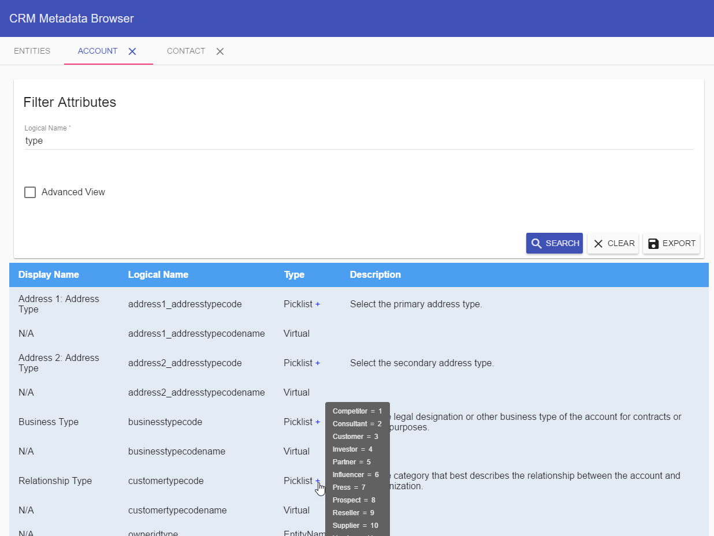

# Dynamics CRM

## Widgets

### Lookup Link

Display a custom link next to any lookup attribute in a CRM form. Allows the user to open the target record in a new window.


#### Configuration

Pass the target attribute as a custom parameter.



### Custom Lookup

For advanced users.


#### Configuration

| Key | Type | Value | Required |
| --- | --- | --- | --- |
| attribute | string | new_value | Yes |
| types | list | 1,2,8,9,1024,1036,2010,4400 | Yes |
| new | boolean | true or false | No |
| style | string | multi or simple | No |


### Metadata Browser




#### Setup

Include the following files in your CRM solution


Ribbon Configuration

```xml
<RibbonDiffXml>
  <CustomActions>    
    <CustomAction Id="[your prefix].ApplicationRibbon.MetadataBrowserButton.CustomAction" Location="Mscrm.BasicHomeTab.Tools.Controls._children" Sequence="7">
      <CommandUIDefinition>
        <Button Alt="$LocLabels:[your prefix].ApplicationRibbon.MetadataBrowserButton.Alt" Command="[your prefix].ApplicationRibbon.MetadataBrowserCommand" Description="Launch Metadata Browser" Id="[your prefix].ApplicationRibbon.MetadataBrowserButton" Image32by32="$webresource:[your prefix]_/Widgets/MetadataBrowser/Images/icon_32.png" Image16by16="$webresource:[your prefix]_/Widgets/MetadataBrowser/Images/icon_16.png" LabelText="$LocLabels:[your prefix].ApplicationRibbon.MetadataBrowserButton.LabelText" Sequence="7" TemplateAlias="o1" ToolTipTitle="$LocLabels:[your prefix].ApplicationRibbon.MetadataBrowserButton.ToolTipTitle" ToolTipDescription="$LocLabels:[your prefix].ApplicationRibbon.MetadataBrowserButton.ToolTipDescription" />
      </CommandUIDefinition>
    </CustomAction>
  </CustomActions>
  <Templates>
    <RibbonTemplates Id="Mscrm.Templates"></RibbonTemplates>
  </Templates>
  <CommandDefinitions>    
    <CommandDefinition Id="[your prefix].ApplicationRibbon.MetadataBrowserCommand">
      <EnableRules />
      <DisplayRules>
        <DisplayRule Id="[your prefix].ApplicationRibbon.MetadataBrowserDisplayRule" />
      </DisplayRules>
      <Actions>
        <Url Address="$webresource:[your prefix]_/Widgets/MetadataBrowser/Html/main.html" WinMode="0" WinParams="resizable=yes" />
      </Actions>
    </CommandDefinition>
  </CommandDefinitions>
  <RuleDefinitions>
    <TabDisplayRules />
    <DisplayRules>      
      <DisplayRule Id="[your prefix].ApplicationRibbon.MetadataBrowserDisplayRule">
        <OrRule>
          <Or>
            <PageRule Address="/tools/systemcustomization/systemcustomization.aspx" />
          </Or>
          <Or>
            <PageRule Address="/tools/Solution/home_solution.aspx" />
          </Or>
        </OrRule>
      </DisplayRule>
    </DisplayRules>
    <EnableRules />
  </RuleDefinitions>
  <LocLabels>
    <LocLabel Id="[your prefix].ApplicationRibbon.MetadataBrowserButton.Alt">
      <Titles>
        <Title description="Metadata Browser" languagecode="1033" />
      </Titles>
    </LocLabel>
    <LocLabel Id="[your prefix].ApplicationRibbon.MetadataBrowserButton.LabelText">
      <Titles>
        <Title description="Metadata Browser" languagecode="1033" />
      </Titles>
    </LocLabel>
    <LocLabel Id="[your prefix].ApplicationRibbon.MetadataBrowserButton.ToolTipDescription">
      <Titles>
        <Title description="Launch Metadata Browser" languagecode="1033" />
      </Titles>
    </LocLabel>
    <LocLabel Id="[your prefix].ApplicationRibbon.MetadataBrowserButton.ToolTipTitle">
      <Titles>
        <Title description="Metadata Browser" languagecode="1033" />
      </Titles>
    </LocLabel>
  </LocLabels>
</RibbonDiffXml>


